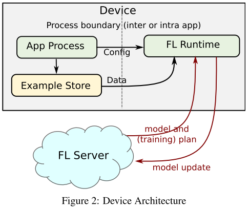

> Bonawitz, Keith et al. “Towards Federated Learning at Scale: System Design.” (2019): n. pag. Web.

## 1. Introduction

- "Bring the code to the data, instead of the data to the code. "
- Recently there has been a consistent trend towards **synchronous large batch training**, even in the data center (Goyal et al., 2017; Smith et al., 2018).

## 2. Protocol

1. **Selection**: The server selects a subset of connected devices based on certain goals like the optimal number of participating devices (typically a few hundred devices participate in each round). If a device is not selected for participation, the server responds with instructions to reconnect at a later point in time.1 for participation, the server responds with instructions to reconnect at a later point in time.
2. **Configuration**: configure base on selected mechanism. 
3. **Reporting**: Server waits for replies, as updates are received, the server aggregates them using Federated Averaging and instructs the reporting devices when to reconnect. If enough devices report in time, the round will be success- fully completed and the server will update its global model, otherwise the round is abandoned

## 3. Device

## 8. Applications

- **On-device item ranking**: any potentially private information from the search query and user selection remains on the device.
- **Content suggestions for on-device keyboards**: 