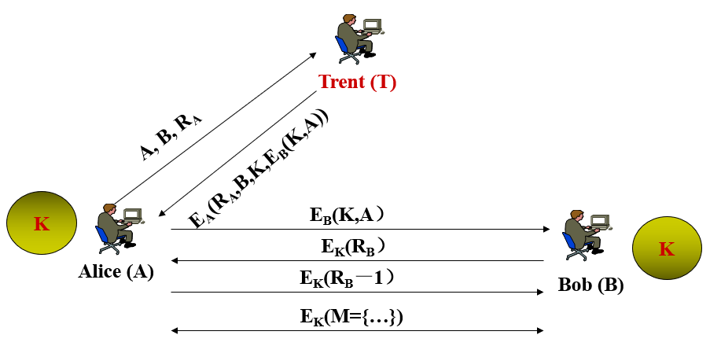
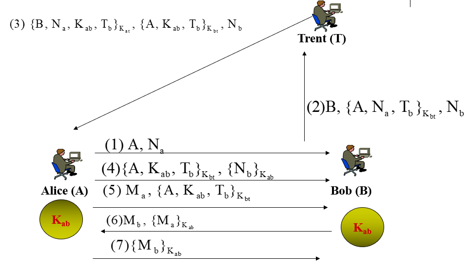
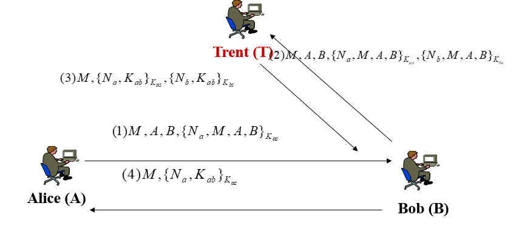

- 认证和密钥交换协议
  1. 首先对通信实体的身份进行验证
  2. 若认证成功则交换密钥

### 一、协议描述

#### 1. Needham-Schroeder协议

**协议目的**		基于认证服务器实现双向认证和密钥交换。

**变量表**

| 变量        | h含义                  |
| ----------- | ---------------------- |
| $T$         | Trent                  |
| $R_i$       | i生成的随机数          |
| $E_i$       | 使用i的密钥进行加密    |
| $K$         | 会话密钥               |
| $M$         | 消息                   |
| $A\ and\ B$ | 通信双方（Alice，Bob） |

**协议流程**

1. $(A\rightarrow T):A,B,R_A​$

2. $(T\rightarrow A):E_A(R_A,B,K,E_B(K,A))​$

3. $(A\rightarrow B):E_B(K,A)$

4. $(B\rightarrow A):E_k(R_B)$

5. $(A\rightarrow B):E_K(R_B-1)$

6. $(A\leftrightarrow B):E_k(M=\{\dots\})$

   

**协议描述**

1. Alice想要与Bob进行通信，向认证服务器Trent发送通信双方$A,B$，与一个自己生成的随机数$R_A$。
2. Trent在收到Alice的消息后使用其与Alice的共享密钥$E_A$加密前一消息中的随机数，$B$，其为Alice和Bob分配的会话密钥$K$和由Trent与Bob的共享密钥所加密的$(K,A)$。
3. Alice收到消息后进行解密，确认随机数和通信方正确后保存会话密钥$K$，并将消息的最后一部分发送给Bob，使得Bob可以知道与其进行通信的对象和会话密钥。
4. Bob对消息进行解密后向Alice发送使用会话密钥加密的随机数。
5. Alice收到后进行解密并将此随机数减一后再使用会话密钥加密后发回给Bob。
6. 此时，Alice和Bob的认证和密钥交换已经完成，双方可以在会话密钥下进行保密通信。

**攻击方式**

1. 消息重放攻击

   由于在上述流程中消息（4）不具有新鲜性，所以如果攻击者获知以前的一个工作密钥，则可以通过重放消息（4）于Bob建立会话。

#### 2. Needham-Schroeder公钥认证协议

**协议目的**		通信双方在可信第三方的条件下使用公钥系统建立行的共享密钥并实现认证。

**变量表**

| 变量        | 描述               |
| ----------- | ------------------ |
| $A\ and\ B$ | 通信双方Alice与Bob |
| $T$         | 可信第三方         |
| $K_{ij}$    | i与j的公共密钥     |
| $T_i$       | 由i生成的时间戳    |
| $M_i,N_i$   | 由i生成的随机数    |
| $K_i^{-1}$  | $i$的私钥          |

**协议流程**

1. $(A\rightarrow T): A,B$
2. $(T\rightarrow A):\{K_b,B\}_{K_t^{-1}}$
3. $(A\rightarrow B): \{N_a,A\}_{K_b}​$
4. $(B\rightarrow T):A,B$
5. $(T\rightarrow B):\{K_a,A\}_{K_t^{-1}}$
6. $(B\rightarrow A): \{N_a,N_b\}_{K_a}$
7. $(A\rightarrow B): \{N_b\}_{K_{b}}$

**协议描述**

#### 3. Neuman-Stubblebine协议

**协议目的**		通信双方在可信第三方的条件下实现认证及密钥交换。 

**变量表**			同上。

**协议流程**

1. $(A\rightarrow B):A,N_a$

2. $(B\rightarrow T):B,\{A,N_a,T_b\}_{K_{bt}},N_b$

3. $(T\rightarrow A):\{B,N_a,K_{ab},T_b\}_{k_{at}},(A,K_{ab},T_b),N_b​$

4. $(A\rightarrow B):\{A,K_{ab},T_b\}_{K_{bt}},\{N_b\}_{K_{ab}}$

5. $(A\rightarrow B):M_a,\{A,K_{ab},T_b\}_{K_{bt}}$

6. $(B\rightarrow A):M_b,\{M_a\}_{K_{ab}}​$

7. $(A\rightarrow B):\{M_b\}_{K_{ab}}$

   

**协议描述**

1. Alice告知Bob想要与其进行安全通信。将其身份与一随机数发送给Bob。
2. Bob收到消息后生成自己的随机数与一个时间戳，并使用自己与Trent的共有密钥加密后发送给Trent。
3. Trent收到消息后生成一个会话密钥，还将此会话密钥使用与Bob的共有密钥加密后发送给Alice。
4. Alice将消息后半部分转发给Bob，同时验证$N_a$是否为开始时的值。而Bob则会验证$T_b$和$N_b$与开始时一致。
5. Alice向Bob发送先前从Trent处收到的信息，并附加一个新的随机数。
6. Bob也发送一个新的随机数并将Alice的随机数用会话密钥加密后一并发回。
7. Alice将Bob 的随机数使用会话密钥加密后发回，Bob验证无误后，此时通信已经成功建立。

**攻击方式**

1. 归因于类型缺陷攻击

#### 4. Otway-Rees协议

**协议目的**		使得通信双方通过可信第三方交换会话密钥。

**变量表**		同上。

**协议流程**

1. $(A\rightarrow B):M,A,B,\{N_a,M,A,B\}_{K_{at}}​$

2. $(B\rightarrow T):M,A,B,\{N_a,M,A,B\}_{K_{at}},\{N_b,M,A,B\}_{K_{bt}}​$

3. $(T\rightarrow B):M,\{N_a,K_{ab}\}_{K_{at}},\{N_b.K_{ab}\}_{K_{bt}}$

4. $(B\rightarrow A):M,\{N_a,K_{ab}\}_{K_{at}}$

   

**协议描述**

1. Alice想要与Bob建立通信，向其发送通信双方名称和一Nonce，还有Alice与可信服务器Trent的共享密钥加密的随机数和通信方。
2. Bob收到消息后向Trent转发消息的加密部分，并添加使用自己与Trent共享密钥加密的通信双方和自己生成的一个随机数。
3. Trent返回用于Alice和Bob分别的共享密钥加密的会话密钥。
4. Bob收到消息解密后检查$N_b$是否正确，并把Alice的部分转发给Alice。
5. Alice解密后确认$N_a$是否正确，此时双方密钥交换已经完成。